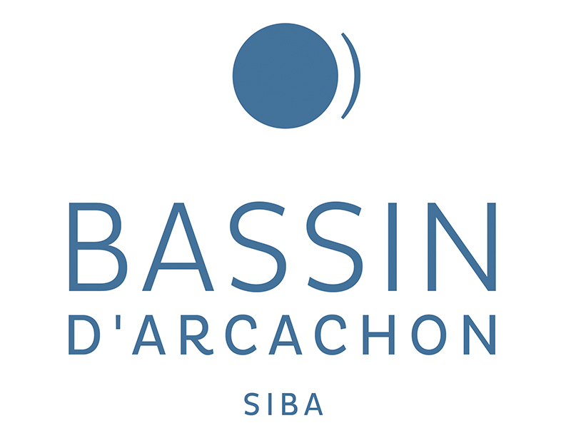

# Les différentes sources de données utilisées au PNMBA
Le PNMBA est en partenaire avec plusieurs entrepprises, entreprise et acteurs locaux dans le cadre de la réalisation de ses missions de sauvegarde de la biodiversité. Cela est un grand atout pour avoir les données et ressources nécessaires exploitables en géomatiques. 
Ces sources sont : 
<!-- ================= SECTION SOURCES ================= -->

<section style="
  background-image: url('images/fond_bassin.jpg');
  background-size: cover;
  background-position: center;
  padding: 60px 20px;
  text-align: center;
  color: white;
">

<h2 style="margin-bottom:40px;">Sources de données</h2>

  <!-- CARD -->
  

    
    
<strong>SIBA</strong> 
    Référentiel des infrastructures et données géographiques du Bassin d'où provient les coordonnées des toponymes.
    

  

  

    
    
<strong>BRGM</strong> 
    Données géologiques, hydrogéologiques et altimétriques.
    

  

  

    
    
<strong>IGN</strong> 
    Cartes topographiques et orthophotographies.
    

  

  

    
    
<strong>SHOM</strong> 
    Données maritimes et bathymétriques.
    

  

  

    
    
<strong>IFREMER</strong> 
    Études sur les milieux marins.
    

  

</section>

</section>

  

    
    
<strong>SIBA</strong> 
    Référentiel des infrastructures et données géographiques.
    

  

  

   
    
<strong>BRGM</strong> 
    Données géologiques et hydrogéologiques.
    

  

